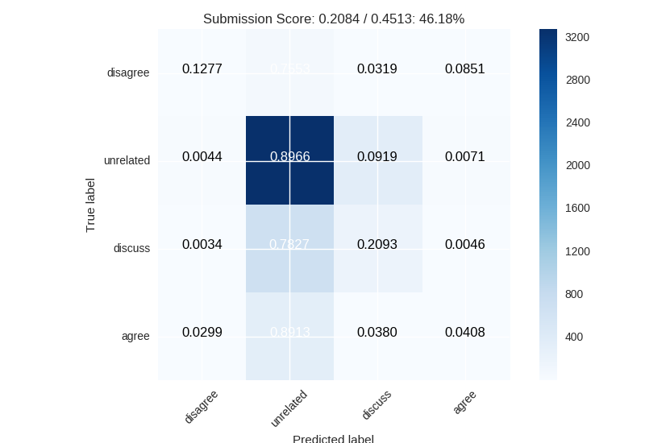
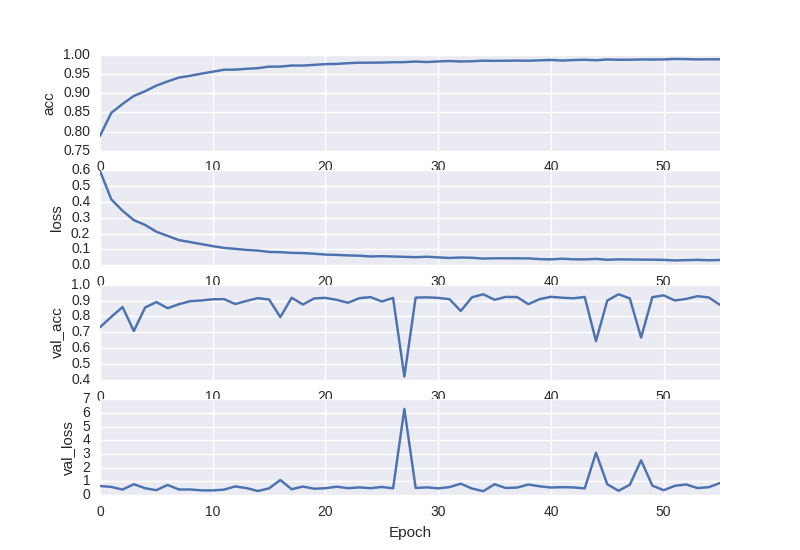

# Fake News Challenge

Playing around with the [Fake News Data
Challenge](http://www.fakenewschallenge.org). Bellow are the results of two
models I've been playing with.

## Installation

Start a virtualenv and install everything in the `requirements.txt` file. In
order to run the Skipthoughts-RNN model, you must also download all the
pretrained skipthought models, as described in the skipthoughts submodule.

```
$ venv -p python3.5 venv
$ source ./venv/bin/activate
(venv)$ pip install -r requirements.txt
```

## Models

|                | *Accuracy* | Score per Label | Max SpL | *Percent Score* |
| -------------- | ---------- | --------------- | ------- | --------------- |
| AdaBoost       | 69.8%      | 0.2083          | 0.4512  | 46.18%          |
| Skipthougt+RNN | 93.9%      | 0.4312          | 0.4518  | 95.44%          |


### Strawman: Adaboost

Self-contained within the [simple_model.py](simple_model.py) file.

- independently tfidf the headline and the bodies into 1024 dim vectors
- concatinate tfidf vectors
- feed into adaboost model

Accuracy: 69.8%

Score per label: 0.2083 out of 0.4512 (46.18%)




### Skip-thoughts + RNN

Preprocessing done with [preprocess.py](preprocess.py) and then model trained
and evaluated with [model.py](model.py).

- Skipthought encode every sentence in the headline, every sentence in the body
- Merge multi-sentence headlines by taking the mean of the headline vectors
- Take the product of the body vectors with the headline vectors and abs()
- Feed into GRU -> Dense

Accuracy: 93.9%

Score per label: 0.4312 /.4518 (95.44)




## Notes
- A random model would get an accuracy of 14.4%
- A model only predicting 'unrelated' would get an accuracy of 73.1%
