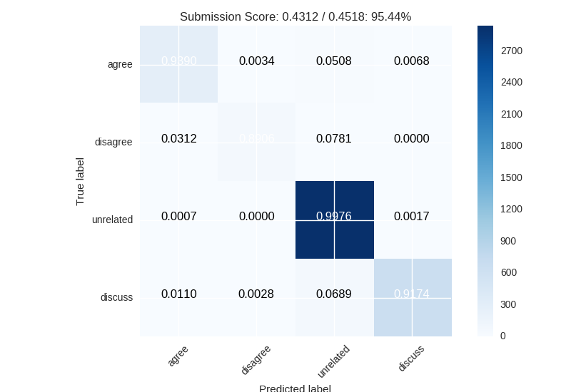

# Fake News Challenge

# Models

## Strawman: Adaboost

- independently tfidf the headline and the bodies into 1024 dim vectors
- concatinate tfidf vectors
- feed into adaboost model

Accuracy: 69.8%
Score per label: 0.2083 out of 0.4512 (46.18%)

## Skip-thoughts + RNN

- Skipthought encode every sentence in the headline, every sentence in the body
- Merge multi-sentence headlines by taking the mean of the headline vectors
- Take the product of the body vectors with the headline vectors and abs()
- Feed into GRU -> Dense

Accuracy: 93.9%
Score per label: 0.4312 /.4518 (95.44)

## Notes
- A random model would get an accuracy of 14.4%
- A model only predicting 'unrelated' would get an accuracy of 73.1%
